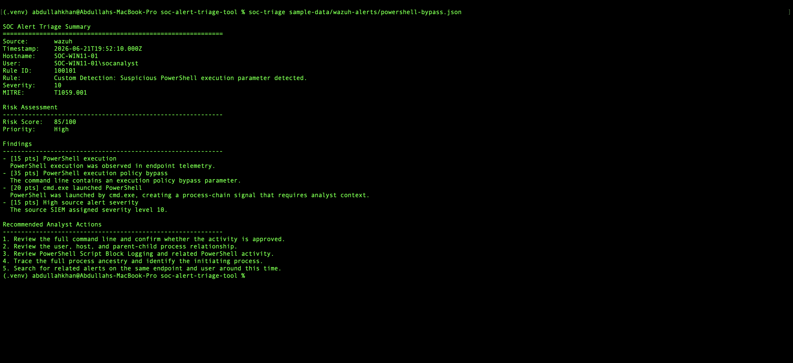
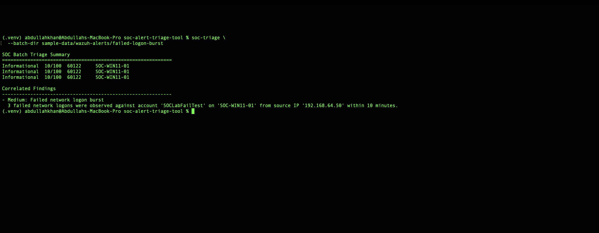
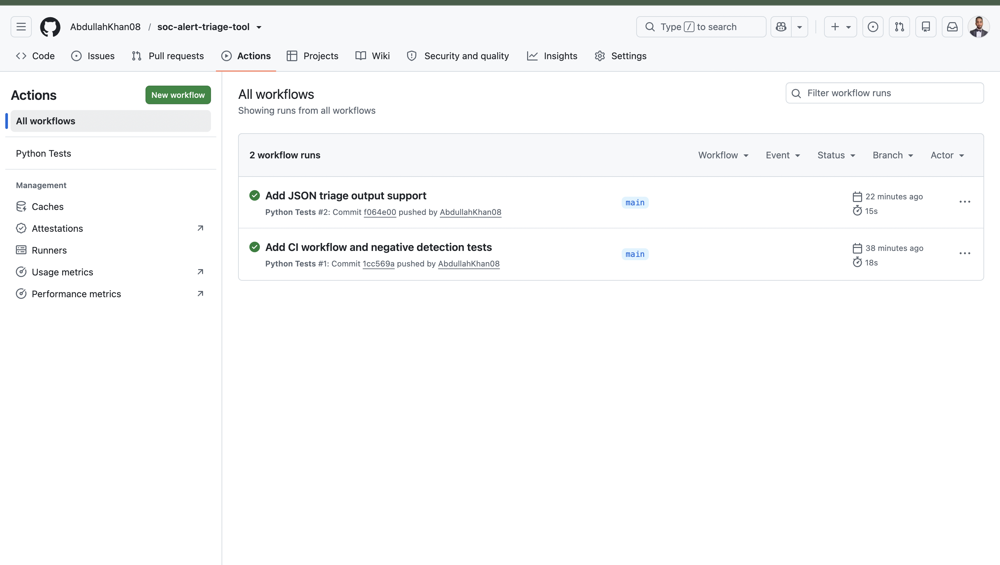

# SOC Alert Triage Tool

A Python-based SOC analyst utility that normalizes security alerts, identifies suspicious indicators, calculates transparent risk scores, and generates Markdown triage reports.

[](https://github.com/AbdullahKhan08/soc-alert-triage-tool/actions/workflows/tests.yml)

## Features

- Normalizes Wazuh JSON alerts into a source-independent alert model
- Detects suspicious PowerShell execution, execution-policy bypass, encoded commands, and `cmd.exe → powershell.exe` process chains
- Detects scheduled task registration, Startup-folder persistence, local account creation, and failed network logons
- Calculates transparent risk scores with explainable findings and recommended analyst actions
- Generates Markdown triage reports for individual alerts and batches
- Supports batch analysis and failed-network-logon burst correlation
- Provides human-readable CLI output and machine-readable JSON output
- Includes positive and negative test cases, local validation checks, and GitHub Actions CI

## Project Goal

Security analysts often receive alerts from multiple data sources with inconsistent fields and varying severity. This project builds a repeatable triage workflow that:

- normalizes alert data
- extracts investigation-relevant fields
- identifies suspicious behavior
- assigns a transparent risk score
- recommends analyst actions
- generates structured triage reports

## Planned Supported Data

- Wazuh JSON alert exports
- Sysmon-style process telemetry
- Windows Security event exports
- Generic JSON and CSV security events

## Planned Detection Logic

- Suspicious PowerShell parameters
- Encoded PowerShell
- `cmd.exe → powershell.exe` process chains
- Scheduled task registration
- Startup-folder file creation
- Local account creation
- Failed network logon bursts
- Suspicious Windows utility execution

## Architecture

The tool follows a simple pipeline:

```text
Input Alert or Log
        ↓
Normalization
        ↓
Detection Rules
        ↓
Risk Scoring
        ↓
Triage Recommendation
        ↓
Markdown Report
```

## Example Commands

### Analyze a High-Risk PowerShell Alert

```bash
soc-triage sample-data/wazuh-alerts/powershell-bypass.json
```

Example result:

```text
Risk Score:   85/100
Priority:     High

Findings
------------------------------------------------------------
- [15 pts] PowerShell execution
- [35 pts] PowerShell execution policy bypass
- [20 pts] cmd.exe launched PowerShell
- [15 pts] High source alert severity
```

### Correlate a Failed Network Logon Burst

```bash
soc-triage \
  --batch-dir sample-data/wazuh-alerts/failed-logon-burst
```

Example result:

```text
SOC Batch Triage Summary
============================================================
Informational  10/100  60122     SOC-WIN11-01
Informational  10/100  60122     SOC-WIN11-01
Informational  10/100  60122     SOC-WIN11-01

Correlated Findings
------------------------------------------------------------
- Medium: Failed network logon burst
  3 failed network logons were observed against account
  'SOCLabFailTest' on 'SOC-WIN11-01' from source IP
  '192.168.64.50' within 10 minutes.
```

The tool supports human-readable CLI output, Markdown triage reports, and machine-readable JSON output for future automation or dashboard integrations.

Detailed design documents are available in the [`docs`](./docs) directory.

For setup instructions and command examples, see the [Usage Guide](docs/usage.md).

## Example Output

### High-Risk PowerShell Triage



### Failed Logon Burst Correlation



### Continuous Integration



## Project Status

- [x] Project architecture defined
- [x] Alert data model implemented
- [x] Wazuh JSON normalizer implemented
- [x] Multi-scenario detection and scoring engine implemented
- [x] Markdown report generator implemented
- [x] Single-alert and batch CLI workflows implemented
- [x] Failed network logon burst correlation implemented
- [x] Machine-readable JSON output implemented
- [x] Positive and negative detection tests added
- [x] Local validation command added
- [x] GitHub Actions CI added
- [x] Usage documentation and evidence screenshots added
